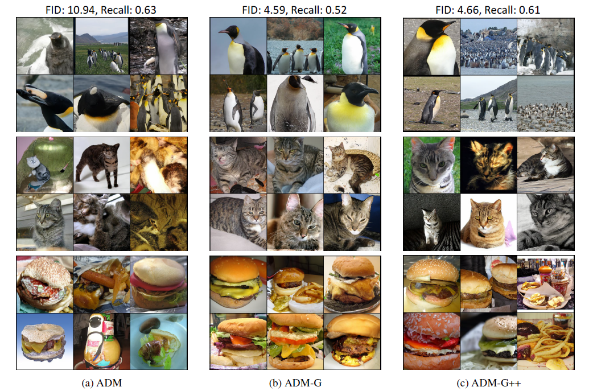

## Refining Generative Process with Discriminator Guidance in Score-based Diffusion Models (DG) (under review)  Official PyTorch implementation of the Discriminator Guidance 
| [paper](https://arxiv.org/abs/2211.17091) |  
**ArXiv will be updated soon**  
**Code will be released soon**  

 

**Refining Generative Process with Discriminator Guidance in Score-based Diffusion Models** 
**[Dongjun Kim](https://github.com/Kim-Dongjun) \*, [Yeongmin Kim](https://github.com/alsdudrla10) \*, Se Jung Kwon, Wanmo Kang, and Il-Chul Moon**   
 * Equal contribution 
 

