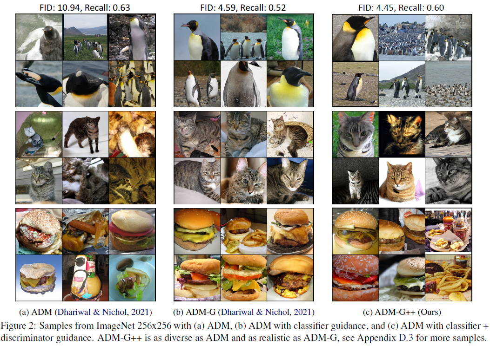

## Refining Generative Process with Discriminator Guidance in Score-based Diffusion Models (DG) (under review)  Official PyTorch implementation of the Discriminator Guidance 
**[Dongjun Kim](https://github.com/Kim-Dongjun) \*, [Yeongmin Kim](https://github.com/alsdudrla10) \*, Se Jung Kwon, Wanmo Kang, and Il-Chul Moon**   
 * Equal contribution   

| [paper](https://arxiv.org/abs/2211.17091) |   
**ArXiv will be updated soon**  
**Code will be released soon**  

## Overview

 

## Results
|Datasets|Cifar10(l)|Cifar10(u)|Cifar10(c)|FFHQ64(u)|CelebA64(u)|ImageNet256(c)|
| ------------ |-------------- | ------------- | ------------- | ------------- | ------------- | ------------- |
|    Privious SOTA      |     xx     |     xx     |     xx     |     xx     |      xx     |      xx     |      xx     |
|    + Discriminator Guidance       |     xx     |     xx     |     xx     |     xx     |     xx     |      xx     |      xx     |

