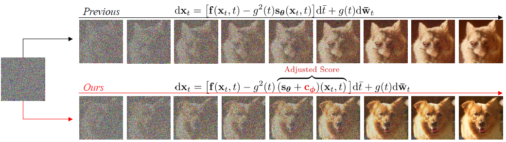

## Refining Generative Process with Discriminator Guidance in Score-based Diffusion Models (DG) (ICML 2023 Oral) <br><sub>Official PyTorch implementation of the Discriminator Guidance </sub>
**[Dongjun Kim](https://sites.google.com/view/dongjun-kim) \*, [Yeongmin Kim](https://sites.google.com/view/yeongmin-space/%ED%99%88) \*, Se Jung Kwon, Wanmo Kang, and Il-Chul Moon**   
<sup> * Equal contribution </sup> <br>

| [paper](https://arxiv.org/abs/2211.17091) |  <br>
**See [alsdudrla10/DG_imagenet](https://github.com/alsdudrla10/DG_imagenet) for ImageNet256 code release.** <br>

## Overview


## Step-by-Step Running of Discriminator Guidance

### 1) Prepare a pre-trained score network
  - Download **edm-cifar10-32x32-uncond-vp.pkl** at [EDM](https://github.com/NVlabs/edm) for unconditional model.
  - Download **edm-cifar10-32x32-cond-vp.pkl** at [EDM](https://github.com/NVlabs/edm) for conditional model.
  - Place **EDM checkpoint** at the directory specified below.  
 
  ```
  ${project_page}/DG/
  ├── checkpoints
  │   ├── pretrained_score/edm-cifar10-32x32-uncond-vp.pkl
  │   ├── pretrained_score/edm-cifar10-32x32-cond-vp.pkl
  ├── ...
  ```

### 2) Generate fake samples
  - To draw 50k unconditional samples, run: 
  ```
  python3 generate.py --network checkpoints/pretrained_score/edm-cifar10-32x32-uncond-vp.pkl --outdir=samples/cifar_uncond_vanilla --dg_weight_1st_order=0
   ```
  - To draw 50k conditional samples, run: 
  ```
  python3 generate.py --network checkpoints/pretrained_score/edm-cifar10-32x32-cond-vp.pkl --outdir=samples/cifar_cond_vanilla --dg_weight_1st_order=0
   ```

### 3) Prepare real data
  - Download [DG/data/true_data.npz](https://drive.google.com/drive/folders/18qh5QGP2gLgVjr0dh2g8dfBYZoGC0uVT) for unconditional model.
  - Download [DG/data/true_data_label.npz](https://drive.google.com/drive/folders/18qh5QGP2gLgVjr0dh2g8dfBYZoGC0uVT) for conditional model.
  - Place **real data** at the directory specified below.
  ```
  ${project_page}/DG/
  ├── data
  │   ├── true_data.npz
  │   ├── true_data_label.npz
  ├── ...
  ```

### 4) Prepare a pre-trained classifier
  - Download [DG/checkpoints/ADM_classifier/32x32_classifier.pt](https://drive.google.com/drive/folders/1gb68C13-QOt8yA6ZnnS6G5pVIlPO7j_y)
  - We train 32 resolution classifier from [ADM](https://github.com/openai/guided-diffusion).
  - Place **32x32_classifier.pt** at the directory specified below.
  ```
  ${project_page}/DG/
  ├── checkpoints
  │   ├── ADM_classifier/32x32_classifier.pt
  ├── ...
  ```

### 5) Train a discriminator
  - Download pre-trained unconditional checkpoint [DG/checkpoints/discriminator/cifar_uncond/discriminator_60.pt](https://drive.google.com/drive/folders/1Mf3F1yGfWT8bO0_iOBX-PWG3O-OLROE2) for the test.
  - Download pre-trained conditional checkpoint [DG/checkpoints/discriminator/cifar_cond/discriminator_250.pt](https://drive.google.com/drive/folders/1P1u7cz7kY1BJDPVrPNiFcksy_HCHY_bI) for the test.
  
  - Place **pre-trained discriminator** at the directory specified below.
  ```
  ${project_page}/DG/
  ├── checkpoints/discriminator
  │   ├── cifar_uncond/discriminator_60.pt
  │   ├── cifar_cond/discriminator_250.pt
  ├── ...
  ```
  - To train the unconditional discriminator from scratch, run:
   ```
   python3 train.py
   ```
   - To train the conditional discriminator from scratch, run:
   ```
   python3 train.py --savedir=/checkpoints/discriminator/cifar_cond --gendir=/samples/cifar_cond_vanilla --datadir=/data/true_data_label.npz --cond=1 
   ```

### 6) Generate discriminator-guided samples
  - To generate unconditional discriminator-guided 50k samples, run: 
  ```
  python3 generate.py --network checkpoints/pretrained_score/edm-cifar10-32x32-uncond-vp.pkl --outdir=samples/cifar_uncond
   ```
  - To generate conditional discriminator-guided 50k samples, run: 
  ```
  python3 generate.py --network checkpoints/pretrained_score/edm-cifar10-32x32-cond-vp.pkl --outdir=samples/cifar_cond --dg_weight_1st_order=1 --cond=1 --discriminator_ckpt=/checkpoints/discriminator/cifar_cond/discriminator_250.pt --boosting=1
   ```
  
### 7) Evaluate FID
  - Download stat files at [DG/stats/cifar10-32x32.npz](https://drive.google.com/drive/folders/1xTdHz2fe71yvO2YpVfsY3sgH5Df7_b6y)
  - Place **cifar10-32x32.npz** at the directory specified below.
  ```
  ${project_page}/DG/
  ├── stats
  │   ├── cifar10-32x32.npz
  ├── ...
  ```
  - Run: 
  ```
  python3 fid_npzs.py --ref=/stats/cifar10-32x32.npz --num_samples=50000 --images=/samples/cifar_uncond/
   ```
  ```
  python3 fid_npzs.py --ref=/stats/cifar10-32x32.npz --num_samples=50000 --images=/samples/cifar_cond/
   ```

## Experimental Results
### EDM-G++
|FID-50k |Cifar-10|Cifar-10(conditional)|FFHQ64|
|------------|------------|------------|------------|
|EDM|2.03|1.82|2.39|
|EDM-G++|1.77|1.64|1.98|

### Other backbones
|FID-50k  |Cifar-10|CelebA64|
|------------|------------|------------|
|Backbone|2.10|1.90|
|Backbone-G++|1.94|1.34|

Note that we use [LSGM](https://github.com/NVlabs/LSGM) for Cifar-10 backbone, and [Soft-Truncation](https://github.com/Kim-Dongjun/Soft-Truncation) for CelebA64 backbone. <br>
See [alsdudrla10/DG_imagenet](https://github.com/alsdudrla10/DG_imagenet) for the results and released code on ImageNet256.

### Samples from unconditional Cifar-10


### Samples from conditional Cifar-10


## Reference
If you find the code useful for your research, please consider citing
```bib
@article{kim2022refining,
  title={Refining Generative Process with Discriminator Guidance in Score-based Diffusion Models},
  author={Kim, Dongjun and Kim, Yeongmin and Kang, Wanmo and Moon, Il-Chul},
  journal={arXiv preprint arXiv:2211.17091},
  year={2022}
}
```
This work is heavily built upon the code from
 - *Karras, T., Aittala, M., Aila, T., & Laine, S. (2022). Elucidating the design space of diffusion-based generative models. arXiv preprint arXiv:2206.00364.*
 - *Dhariwal, P., & Nichol, A. (2021). Diffusion models beat gans on image synthesis. Advances in Neural Information Processing Systems, 34, 8780-8794.*
 - *Song, Y., Sohl-Dickstein, J., Kingma, D. P., Kumar, A., Ermon, S., & Poole, B. (2020). Score-based generative modeling through stochastic differential equations. arXiv preprint arXiv:2011.13456.*


