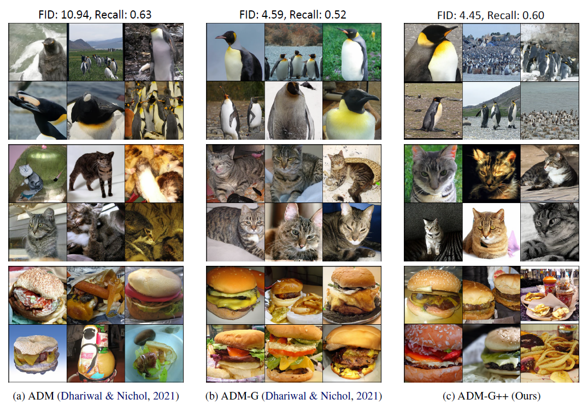

## Refining Generative Process with Discriminator Guidance in Score-based Diffusion Models (DG) (under review)  Official PyTorch implementation of the Discriminator Guidance 
**[Dongjun Kim](https://github.com/Kim-Dongjun) \*, [Yeongmin Kim](https://github.com/alsdudrla10) \*, Se Jung Kwon, Wanmo Kang, and Il-Chul Moon**   
 * Equal contribution   

| [paper](https://arxiv.org/abs/2211.17091) |   
**Code will be released soon**  

## Overview

## Results (Data diffusion)
|FID-50k |Cifar-10|FFHQ64|CelebA64|ImageNet256|
|------------|------------|------------|------------|------------|
|Privious SOTA|2.03|2.39|1.90|4.59|
|+ DG|1.77|1.98|1.34|3.17|

## Results (Latent diffusion)
|FID-50k |Cifar-10|ImageNet256|
|------------|------------|------------|
|Privious SOTA|2.10|2.27|
|+ DG|1.94|1.83|

## Samples from recall-best DG

